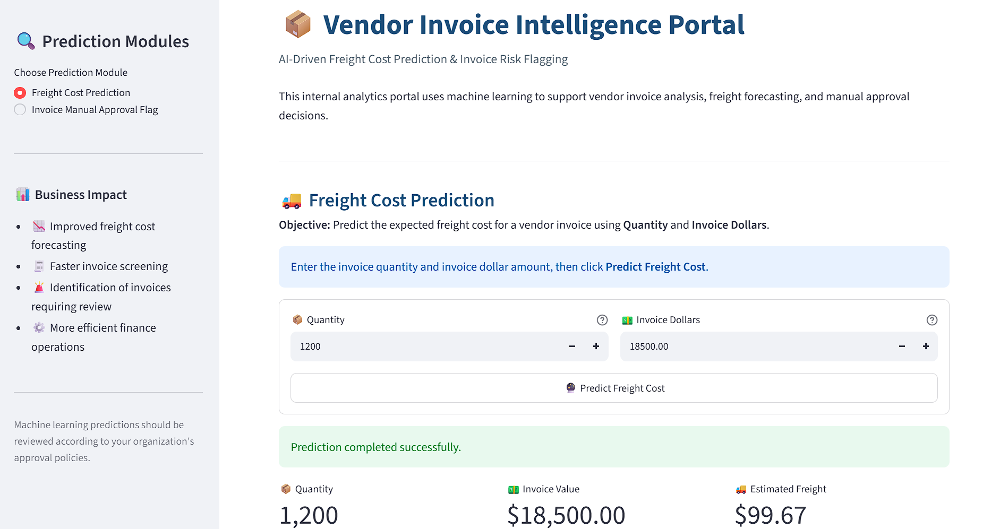
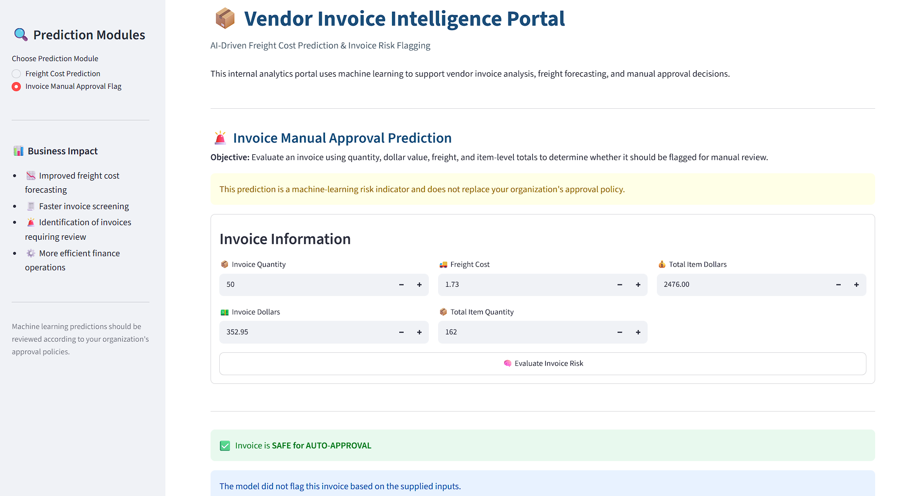

# Vendor Invoice Intelligence System

## Freight Cost Prediction & Invoice Risk Flagging

An end-to-end machine learning system designed to support finance and procurement teams with **vendor invoice intelligence**. The project combines freight cost prediction with invoice risk classification to help identify abnormal invoices and improve financial controls.

----

## 📌 Table of Contents

- [Project Overview](#-project-overview)
- [Business Objectives](#-business-objectives)
- [Data Sources](#-data-sources)
- [Exploratory Data Analysis](#-exploratory-data-analysis)
- [Models Used](#-models-used)
- [Evaluation Metrics](#-evaluation-metrics)
- [End-to-End Application](#-end-to-end-application)
- [Project Structure](#-project-structure)
- [How to Run This Project](#-how-to-run-this-project)
- [Future Improvements](#-future-improvements)
- [Author & Contact](#-author--contact)

---

## 📌 Project Overview

This project implements an **end-to-end machine learning system** designed to support finance teams by:

1. **Predicting expected freight cost** for vendor invoices.
2. **Flagging high-risk invoices** that require manual review due to abnormal cost, freight, or operational patterns.

The system uses data stored in a relational SQLite database, performs SQL-based feature aggregation and exploratory analysis, trains multiple machine learning models, evaluates their performance, and exposes the final models through a **Streamlit application**.

---

## 🎯 Business Objectives

### 1. Freight Cost Prediction (Regression)

**Objective:**  
Predict the expected freight cost for a vendor invoice using quantity, invoice value, and historical behavior.

### 🖼️ Objective Image



<!--
-->

**Why it matters:**

- Freight is a non-trivial component of landed cost.
- Poor freight estimation can impact margin analysis and budgeting.
- Early prediction improves procurement planning and vendor negotiation.

### 2. Invoice Risk Flagging (Classification)

**Objective:**  
Predict whether a vendor invoice should be flagged for manual approval because of abnormal cost, freight, or delivery patterns.

### 🖼️ Objective Image



<!--
-->

**Why it matters:**

- Manual invoice review does not scale.
- Financial leakage can occur in large or complex invoices.
- Early risk detection improves audit efficiency and operational control.

---

## 📂 Data Sources

Data is stored in a relational SQLite database named:

```text
inventory.db
```

The database contains the following tables:

| Table | Description |
|---|---|
| `vendor_invoice` | Invoice-level financial and timing data |
| `purchases` | Item-level purchase details |
| `purchase_prices` | Reference purchase prices |
| `begin_inventory` | Beginning inventory snapshots |
| `end_inventory` | Ending inventory snapshots |

SQL aggregation is used to generate **invoice-level machine learning features** from the underlying tables.

---

## 📊 Exploratory Data Analysis (EDA)

EDA focuses on business-driven questions such as:

- Do flagged invoices have higher financial exposure?
- Does freight scale linearly with quantity?
- Does freight cost depend on quantity?
- Are there meaningful differences between normal and flagged invoices?

Statistical tests, including **t-tests**, are used to investigate whether flagged invoices differ meaningfully from normal invoices.

---

## 🤖 Models Used

### Regression — Freight Prediction

The following models are evaluated:

1. **Linear Regression** — baseline model
2. **Decision Tree Regressor**
3. **Random Forest Regressor** — final model

The Random Forest Regressor is selected as the final freight prediction model based on model evaluation.

### Classification — Invoice Flagging

The following models are evaluated:

1. **Logistic Regression** — baseline model
2. **Decision Tree Classifier**
3. **Random Forest Classifier** — final model

Hyperparameter tuning is performed using **GridSearchCV** with **F1-score** as the optimization metric to better handle class imbalance.

---

## 📈 Evaluation Metrics

### Freight Prediction

Regression models are evaluated using:

- **MAE (Mean Absolute Error)**
- **RMSE (Root Mean Squared Error)**
- **R² Score**

### Invoice Flagging

Classification models are evaluated using:

- **Accuracy**
- **Precision**
- **Recall**
- **F1-score**
- **Classification Report**
- **Feature Importance Analysis**

F1-score is particularly important for the invoice flagging problem because false negatives and false positives both have operational consequences, and the target classes may be imbalanced.

---

## 🖥️ End-to-End Application

A **Streamlit application** demonstrates the complete pipeline.

The application allows users to:

- Enter invoice details.
- Predict expected freight cost.
- Flag potentially risky invoices in real time.
- Provide human-readable explanations of the prediction.

The application acts as the final interface between the trained machine learning models and business users.

---

## 📁 Project Structure

```text
inventory-invoice-analytics/
│
├── data/
│   └── inventory.db
│
├── freight_cost_prediction/
│   ├── data_preprocessing.py
│   ├── model_evaluation.py
│   └── train.py
│
├── invoice_flagging/
│   ├── data_preprocessing.py
│   ├── model_evaluation.py
│   └── train.py
│
├── inference/
│   ├── predict_freight.py
│   └── predict_invoice_flag.py
│
├── models/
│   ├── predict_freight_model.pkl
│   ├── scaler.pkl
│   └── predict_flag_invoice.pkl
│
├── notebooks/
│   ├── Invoice Flagging.ipynb
│   └── Predict Freight Cost.ipynb
│
├── app.py
├── README.md
└── .gitignore
```

---

## ⚙️ How to Run This Project

### 1. Clone the repository

```bash
git clone https://github.com/yourusername/inventory-invoice-analytics.git
cd inventory-invoice-analytics
```

> Replace `yourusername` with the actual GitHub username/repository URL.

### 2. Install dependencies

Create and activate a virtual environment if desired:

```bash
python -m venv venv
```

On Windows:

```bash
venv\Scripts\activate
```

On macOS/Linux:

```bash
source venv/bin/activate
```

Install the required Python packages:

```bash
pip install -r requirements.txt
```

### 3. Train and save the best-fit models

Run the training scripts:

```bash
python freight_cost_prediction/train.py
python invoice_flagging/train.py
```

The trained models and preprocessing artifacts are saved under the `models/` directory.

### 4. Test the models

Run the inference scripts:

```bash
python inference/predict_freight.py
python inference/predict_invoice_flag.py
```

### 5. Open the application

Launch the Streamlit application:

```bash
streamlit run app.py
```

The application can then be opened in the browser using the local Streamlit URL displayed in the terminal.

---

## 🔄 Machine Learning Pipeline

```text
SQLite Database
      │
      ▼
SQL Aggregation & Data Preprocessing
      │
      ▼
Exploratory Data Analysis
      │
      ├───────────────┐
      ▼               ▼
Freight Prediction   Invoice Risk Flagging
(Regression)         (Classification)
      │               │
      ▼               ▼
Model Evaluation & Hyperparameter Tuning
      │               │
      ▼               ▼
Saved Best Models / Preprocessing Artifacts
      │               │
      └───────┬───────┘
              ▼
       Streamlit Application
              │
              ▼
      Business Predictions
```

---

## 💡 Key Business Value

This system demonstrates how machine learning can be applied to practical finance and procurement workflows.

### Potential benefits include:

- Faster invoice review.
- Early identification of potentially abnormal invoices.
- Better freight cost estimation.
- Improved procurement planning.
- Improved vendor negotiations.
- Reduced dependence on manual invoice screening.
- Better audit and operational controls.
- More consistent, data-driven decision making.

---

## 🚀 Future Improvements

Potential extensions include:

- Add explainability using SHAP or similar methods.
- Add model monitoring and drift detection.
- Add automated retraining pipelines.
- Introduce time-based validation for production scenarios.
- Add vendor-level risk scoring.
- Store prediction history for auditability.
- Add authentication and role-based access to the Streamlit application.
- Deploy the application to a cloud platform.
- Add automated unit and integration tests.
- Add CI/CD for model and application updates.

---

## 👤 Author & Contact

**Keshav Goyal**  


📧 Email: `keshavg125@gmail.com`

🔗 LinkedIn: Add your LinkedIn profile URL here  
🔗 Portfolio: Add your portfolio URL here

---

## 📄 License

Add the appropriate license for this project, such as MIT, if you intend to make the repository open source.
